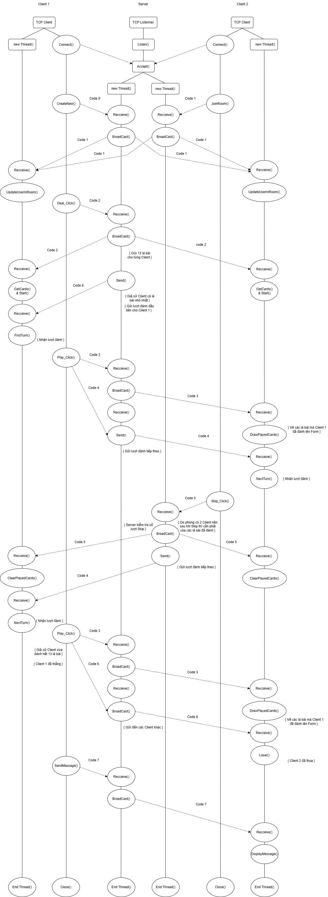

# Đồ án môn học
# Group 5
## Môn học: Lập trình mạng căn bản
## Mã lớp: NT106.P12
# Đề tài: Game tiến lên miền nam
### Danh sách thành viên:
| Họ và tên | MSSV | Gmail |
|--------------|-------|------|
| Phan Mạnh Tân | 23521404 | [23521404@gm.uit.edu.vn](mailto:23521404@gm.uit.edu.vn) |
| Nguyễn Văn Sơn | 23521357 | [23521357@gm.uit.edu.vn](mailto:23521357@gm.uit.edu.vn) | 
| Bùi Ngọc Thái | 23521412 | [23521412@gm.uit.edu.vn](mailto:23521412@gm.uit.edu.vn) | 

`Sever` Branch: `SERVER`

`Client` Branch: `TienLenMienNam`
### Network Stack

##### Đồ Án Mục Đích Phục Vụ Cho Môn Học Lập Trình Mạng Căn Bản!!!

